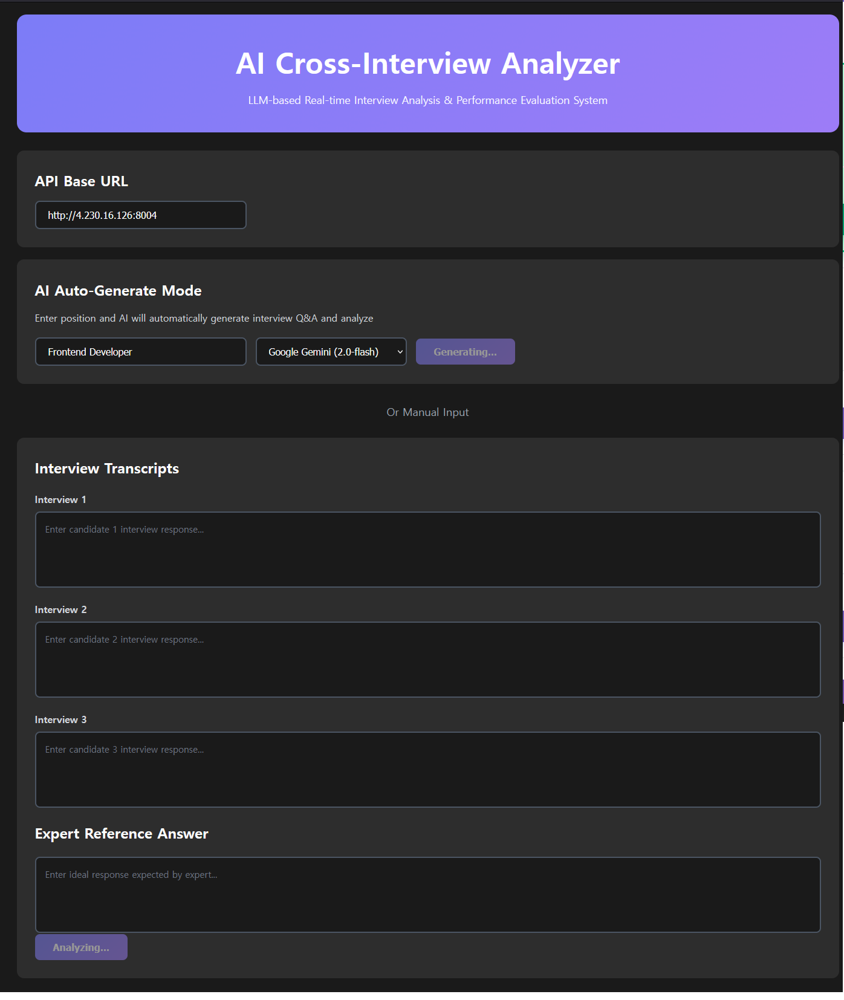
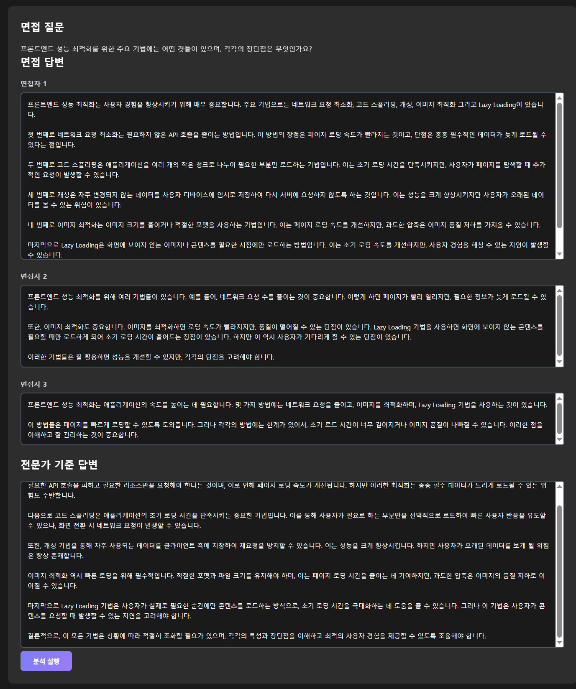
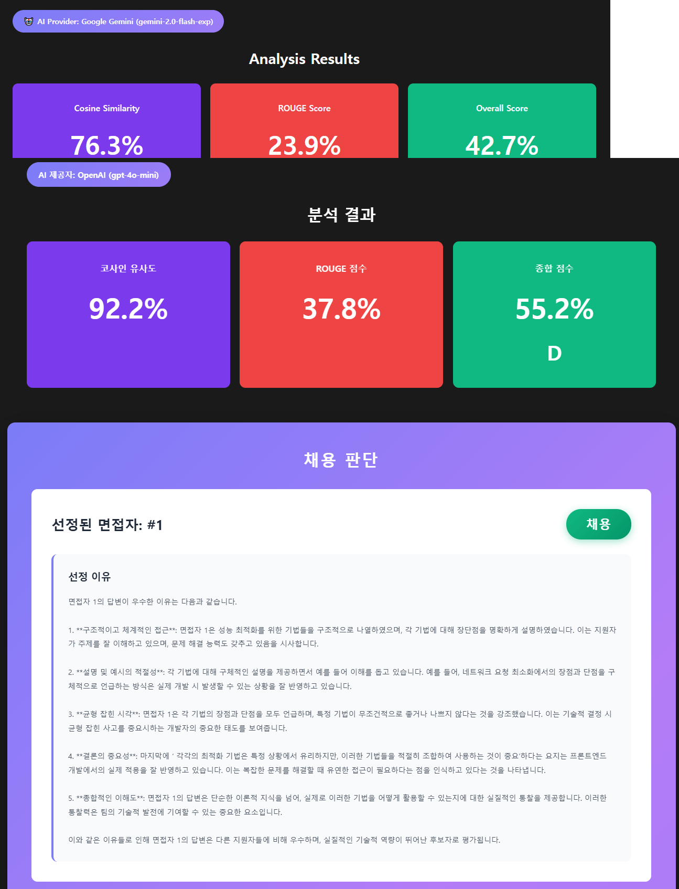
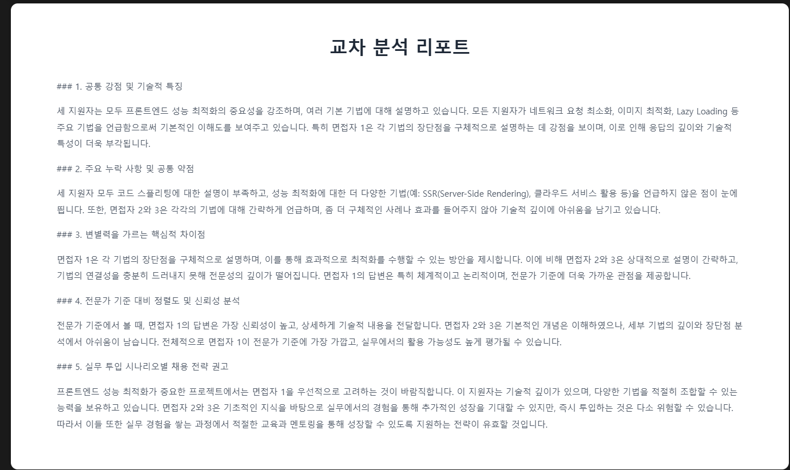

# AI Cross-Interview Analyzer

전문가 기준 답변을 바탕으로 여러 면접 답변을 비교 분석하고, **정량적 점수 + 설명 가능한 채용 인사이트**를 생성하는 LLM 기반 시스템입니다.

[](https://github.com/USERNAME/REPO/actions)
[](#)
[](#)
[](#)
[](#license)

---

## 목차

* [DEMO LIVE](#DEMO-LIVE)
* [프로젝트를 만든 이유](#why-this-project)
* [무엇을 하는가](#what-it-does)
* [스크린샷](#screenshots)
* [아키텍처](#architecture)
* [API](#api)
* [설치 방법](#installation)

  * [백엔드 설정](#backend-setup)
  * [프론트엔드 설정](#frontend-setup)
* [테스트](#testing)
* [배포](#deployment)

  * [systemd 사용](#using-systemd)
  * [Nginx 사용](#using-nginx)
* [개발 가이드](#development)

  * [코드 스타일](#code-style)
  * [Git 워크플로우](#git-workflow)
* [기술 스택](#tech-stack)

---

## DEMO LIVE

* **프론트엔드:** [http://4.230.16.126:5178/](http://4.230.16.126:5178/)
* **백엔드:** [http://4.230.16.126:8012/](http://4.230.16.126:8012/)
* **Swagger:** [http://4.230.16.126:8012/docs](http://4.230.16.126:8012/docs)

---

## 프로젝트를 만든 이유

여러 지원자를 비교 평가하는 면접 과정은 종종 주관적이 되기 쉽습니다.
이 프로젝트는 LLM을 활용해 **비교, 점수화, 그리고 그 근거 제시**를 수행하면서도, 결과를 **측정 가능하고 재현 가능한 형태**로 유지하는 방법을 탐구합니다.

포트폴리오 프로젝트를 검토하는 입장에서 이 프로젝트의 목표는 명확합니다.
단순한 “LLM 텍스트 생성”이 아니라, **반복 가능한 정량 지표 + 의사결정에 바로 사용할 수 있는 요약 결과**를 만들어내는 워크플로우임을 보여주는 것입니다.

---

## 무엇을 하는가

### 핵심 워크플로우

* **1명 이상의 지원자 면접 답변**과 **전문가 기준 답변**을 입력으로 받음
* 지원자 간 **교차 분석 리포트** 생성 (경향, 차이점, 추천 사항)
* 다음 지표를 활용해 정합도 점수 계산:

  * **코사인 유사도(임베딩 기반)**
  * **ROUGE 유사 지표(텍스트 중복도)**
* 결과로 다음을 생성:

  * 전체 점수 및 등급
  * 지원자별 점수
  * 간단한 근거를 포함한 **채용 결정 결과**

### 데모 워크플로우 (자동 생성)

* 특정 직무에 대해 가상의 지원자 답변과 기준 답변 자동 생성
* 즉시 전체 분석 파이프라인 실행
* 다음 용도로 유용:

  * 리뷰어 데모
  * UI 스크린샷 제작
  * 빠른 엔드투엔드 회귀 테스트

---

## 스크린샷

### 1) 메인 인터페이스 (수동 입력 방식)



### 2) 자동 생성 모드 (데모 친화적)



### 3) 채용 결정 결과 (의사결정용 출력)



### 4) 엔드투엔드 결과 스냅샷



---

## 기술 스택

### 백엔드

* **FastAPI** – 고성능 Python 웹 프레임워크
* **OpenAI GPT-4** – 생성 및 분석을 위한 LLM
* **Pydantic** – 데이터 검증 및 설정 관리
* **Uvicorn** – ASGI 서버

### 프론트엔드

* **React 18** – UI 라이브러리
* **Vite** – 빌드 도구
* **Axios** – HTTP 클라이언트

### DevOps

* **GitHub Actions** – CI/CD 자동화
* **Nginx** – 리버스 프록시
* **systemd** – 서비스 관리
* **pytest** – 테스트 프레임워크

---

## 아키텍처

```
├── backend/
│   ├── main.py           # FastAPI 애플리케이션 엔트리 포인트
│   ├── routes.py         # API 엔드포인트 정의
│   ├── services.py       # 비즈니스 로직 계층
│   ├── models.py         # Pydantic 데이터 모델
│   └── test_main.py      # 단위 테스트
├── frontend/
│   ├── src/
│   │   ├── App.jsx       # 메인 React 컴포넌트
│   │   └── App.css       # 스타일링
├── deployment/
│   ├── systemd.service   # systemd 설정 파일
│   └── nginx.conf        # Nginx 리버스 프록시 설정
└── .github/
    └── workflows/
        └── ci.yml        # GitHub Actions CI 파이프라인
```

---

## API

Swagger UI는 다음 주소에서 확인할 수 있습니다:

* http://4.230.16.126:8012/docs 

### POST http://4.230.16.126:8012/docs

직무에 맞는 전체 데모 데이터(지원자 + 전문가 기준 답변)를 생성하고 즉시 평가를 수행합니다.

면접 답변을 직접 작성하지 않고 시스템을 테스트하거나 시연할 때 사용합니다.

**요청 예시:**

```json
{
  "job_position": "Frontend Developer",
  "num_candidates": 3
}
```

**응답 예시:**

```json
{
  "report": "교차 분석 리포트...",
  "score": 0.47,
  "cosine_score": 0.65,
  "rouge_score": 0.20,
  "grade": "D",
  "transcripts": ["...", "...", "..."],
  "reference": "...",
  "hire_decision": {
    "selected_candidate": 3,
    "reason": "간단한 설명...",
    "scores": [
      { "candidate_number": 1, "cosine_score": 0.60, "rouge_score": 0.20, "overall_score": 0.44, "grade": "D" }
    ]
  }
}
```

### POST `/interviews/analyses`

사용자가 제공한 면접 답변을 분석합니다.

**요청 예시:**

```json
{
  "transcripts": [
    "지원자 1 답변...",
    "지원자 2 답변..."
  ],
  "reference": "전문가 기준 답변..."
}
```

---

## 설치 방법

### 사전 요구사항

* Python 3.11 이상
* Node.js 18 이상
* OpenAI API 키

### 백엔드 설정

```bash
cd backend
python -m venv venv
source venv/bin/activate
pip install -r requirements.txt
export OPENAI_API_KEY='your-api-key-here'
uvicorn main:app --reload --port 8004
```

### 프론트엔드 설정

```bash
cd frontend
npm install
npm run dev
```

---

## 배포

### systemd 사용

```bash
sudo cp deployment/systemd.service /etc/systemd/system/interview-analyzer.service
sudo systemctl daemon-reload
sudo systemctl enable interview-analyzer
sudo systemctl start interview-analyzer
```

### Nginx 사용

```bash
sudo cp deployment/nginx.conf /etc/nginx/sites-available/interview-analyzer
sudo ln -s /etc/nginx/sites-available/interview-analyzer /etc/nginx/sites-enabled/
sudo nginx -t
sudo systemctl reload nginx
```

---

## 개발 가이드

### 코드 스타일

이 프로젝트는 Python 코드 포맷팅을 위해 Black을 사용하며 PEP 8 가이드라인을 따릅니다.

Python 코드는 Black과 isort로 포맷되며,
flake8을 사용해 팀 설정에 맞춘 린팅을 수행합니다.

```bash
black .
flake8 .
```

### Git 워크플로우

* 기능 개발: `feature/기능명`
* 버그 수정: `fix/버그설명`
* 커밋당 하나의 작업
* 명확하고 설명적인 커밋 메시지 작성

---

## License

MIT License
